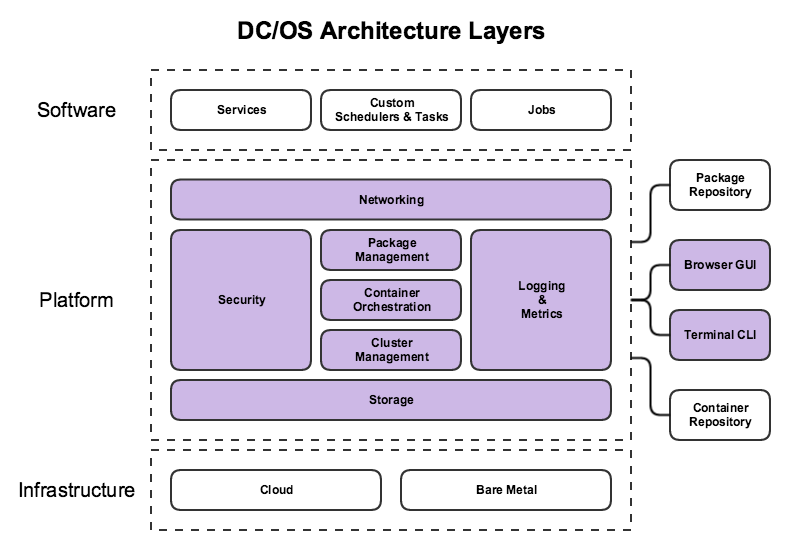

```{r setup, include=FALSE}
knitr::opts_chunk$set(echo = FALSE)
```

## DC/OS

DC/OS is a distributed operating system based on the Apache Mesos distributed systems kernel. It enables the management of multiple machines as if they were a single computer. It automates resource management, schedules process placement, facilitates inter-process communication, and simplifies the installation and management of distributed services. Its included web interface and available command-line interface (CLI) facilitate remote management and monitoring of the cluster and its services.

## What is DC/OS?

* Distributed System
* Cluster Manager
* Container Platform
* Operating System

## Architecture



## Features


* High Resource Utilization
* Mixed Workload Colocation
* Container Orchestration
* Extensible Resource Isolation
* Stateful Storage Support
* Package Management
* Cloud-Agnostic Installer
* Web and Command Line Interfaces
* Elastic Scalability
* High Availability
* Zero Downtime Upgrades
* Integration-Tested Components
* Service Discovery and Distributed Load Balancing
* Control & Management plane for Distributed Load Balancers
* Cluster Perimeter Security
* Identity & Access Management
* External Identity Provider with LDAP, SAML & OpenID Connect
* Cluster security with encrypted communication
* Workload Isolation with Container level authorization
* IP per Container with Extensible Virtual Networks (SDN)
* Network Isolation of Virtual Network Subnets

