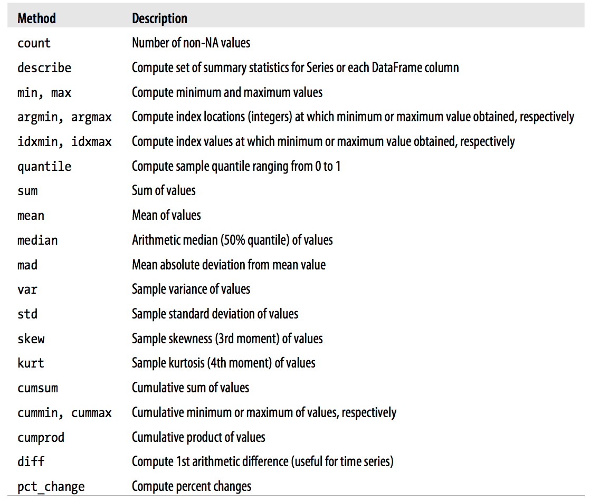

## Data Processing

Data processing is, generally, "the collection and manipulation of items of data to produce meaningful information." In this sense it can be considered a subset of information processing, "the change (processing) of information in any manner detectable by an observer."

The term Data processing (DP) has also been used previously to refer to a department within an organization responsible for the operation of data processing applications.

[Source: Wikipedia](https://en.wikipedia.org/wiki/Data_processing)

## Common Data Processing Tasks

* Clean
* Transform
* Merge
* Reshape

## What we can do with pandas?

* **pandas.merge** connects rows in DataFrames based on one or more keys. This will be familiar to users of SQL or other relational databases, as it implements database join operations.
* **pandas.concat** glues or stacks together objects along an axis.
* **combine_first** instance method enables splicing together overlapping data to fill in missing values in one object with values from another.

## Database-Style Dataframes Merge

```{python, eval=FALSE}
import pandas as pd
df1 = pd.DataFrame({'key': ['b', 'b', 'a', 'c', 'a', 'a', 'b'], 'data1': range(7)})
df2 = pd.DataFrame({'key': ['a', 'b', 'd'], 'data2': range(3)})
```

This is an example of a many-to-one merge situation; the data in df1 has multiple rows labeled a and b, whereas df2 has only one row for each value in the key column. Calling merge with these objects we obtain:

```{python, eval = FALSE}
pd.merge(df1, df2)
```

## Why did pandas merge it like that?

Note that I didn’t specify which column to join on. If not specified, **merge** uses the overlapping column names as the keys. It’s a good practice to specify explicitly, though:

```{python, eval = FALSE}
pd.merge(df1, df2, on='key')
```

## What about if I have different column names in each data set?

If the column names are different in each object, you can specify them separately:

```{python, eval = FALSE}
df3 = pd.DataFrame({'lkey': ['b', 'b', 'a', 'c', 'a', 'a', 'b'], 'data1': range(7)})
df4 = pd.DataFrame({'rkey': ['a', 'b', 'd'], 'data2': range(3)})
# And now we can merge as this
pd.merge(df3, df4, left_on='lkey', right_on='rkey')
```

## What about the missing data?

You probably noticed that the **'c'** and **'d'** values and associated data are missing from the result. By default **merge** does an **'inner'** join; the keys in the result are the intersec- tion. Other possible options are **'left'**, **'right'**, and **'outer'**. The outer join takes the union of the keys, combining the effect of applying both left and right joins:

```{python, eval = FALSE}
pd.merge(df1, df2, how='outer')
```

## *Many to many* merge situations

Many-to-many merges have well-defined though not necessarily intuitive behavior. Here’s an example:

```{python, eval = FALSE}
df1 = pd.DataFrame({'key': ['b', 'b', 'a', 'c', 'a', 'b'], 'data1': range(6)})
df2 = pd.DataFrame({'key': ['a', 'b', 'a', 'b', 'd'], 'data2': range(5)})
pd.merge(df1, df2, on='key', how='left')
```

Many-to-many joins form the Cartesian product of the rows. Since there were 3 'b' rows in the left DataFrame and 2 in the right one, there are 6 'b' rows in the result. The join method only affects the distinct key values appearing in the result:

```{python, eval = FALSE}
pd.merge(df1, df2, how='inner')
```


## Merge with multiple keys

To merge with multiple keys, pass a list of column names:

```{python, eval = FALSE}
left = pd.DataFrame({'key1': ['foo', 'foo', 'bar'], 'key2': ['one', 'two', 'one'],
'lval': [1, 2, 3]})
right = DataFrame({'key1': ['foo', 'foo', 'bar', 'bar'], 'key2': ['one', 'one', 'one', 'two'],
'rval': [4, 5, 6, 7]})
```


## Subsetting DataFrames

```{python, eval=FALSE}
import pandas as pd
import numpy as np
df = pd.DataFrame({'gender': np.random.choice(['m', 'f'], size=10), 'price': np.random.poisson(100, size=10)})
df.query('gender == "m" and price < 100')
```

## Handling missing Data

```{python, eval=FALSE}
string_data = pd.Series(['aardvark', 'artichoke', np.nan, 'avocado'])
string_data.isnull()
```


## Filtering Out Missing Data

```{python, eval=FALSE}
data = pd.Series([1, NA, 3.5, NA, 7])
data.dropna()
```

## Filling missing data

```{python, eval=FALSE}
df.fillna(0)
```


## Summarizing and Descriptive Statistics

pandas objects are equipped with a set of common mathematical and statistical meth- ods. Most of these fall into the category of reductions or summary statistics, methods that extract a single value (like the sum or mean) from a Series or a Series of values from the rows or columns of a DataFrame

```{python, eval=FALSE}
df = DataFrame(
    [[1.4, np.nan],
    [7.1, -4.5],
    [np.nan, np.nan],
    [0.75, -1.3]],
    index=['a', 'b', 'c', 'd'],
    columns=['one', 'two'])
```

Column sums

```{python, eval=FALSE}
df.sum()
```

Row sums

```{python, eval=FALSE}
df.sum(axis=1)
```

By default NAs are skipped, avoid skip them:

```{python, eval=FALSE}
df.mean(axis=1, skipna=False)
```

Accumulations

```{python, eval=FALSE}
df.cumsum()
```

You can get multiple summary statistics in one shot:

```{python, eval=FALSE}
df.describe()
```

## A list of other methods

