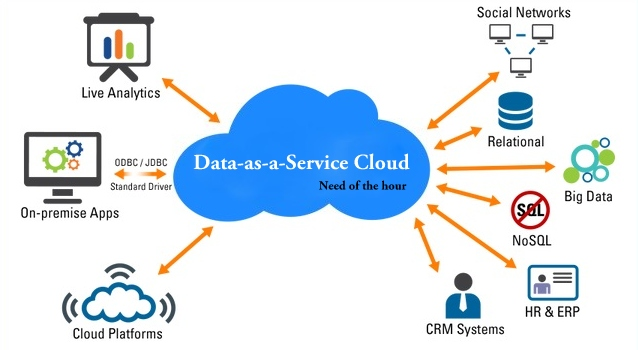

```{r setup, include=FALSE}
knitr::opts_chunk$set(echo = FALSE)
```

## DaaS

In computing, data as a service (or DaaS) is a cousin of software as a service (SaaS).[1] Like all members of the "as a service" (aaS) family, DaaS builds on the concept that the product (data in this case) can be provided on demand[2] to the user regardless of geographic or organizational separation of provider and consumer. Additionally, the emergence[when?] of service-oriented architecture (SOA) has also rendered the actual platform on which the data resides irrelevant.[3] This development has enabled the emergence of the relatively new concept of DaaS.

[Source: Wikipedia](https://en.wikipedia.org/wiki/Data_as_a_service)

## Common deployment scenarios



## DBaaS


A predfined database in the cloud

[Another source: Oracle (Spanish)](http://www.oracle.com/technetwork/es/articles/cloudcomp/oracle-cloud-dbaas-2877305-esa.html)


## Data Analysis

Analysis of data, also known as data analytics, is a process of inspecting, cleaning, transforming, and modeling data with the goal of discovering useful information, suggesting conclusions, and supporting decision-making. Data analysis has multiple facets and approaches, encompassing diverse techniques under a variety of names, in different business, science, and social science domains.

[Source: Wikipedia](https://en.wikipedia.org/wiki/Data_analysis)

## Why do we use graphs in data analysis?


* To understand data properties
* To find patterns in data
* To suggest modeling strategies
* To "debug" analyses
* To communicate results

## Exploratory Graphs

* To understand data properties
* To find patterns in data
* To suggest modeling strategies
* To "debug" analyses

## Characteristics of exploratory graphs


* They are made quickly
* A large number are made
* The goal is for personal understanding
* Axes/legends are generally cleaned up (later)
* Color/size are primarily used for information

## Simple summaries of data


* Five-number summary
* Boxplots
* Histograms
* Density plot
* Barplot


## Let's make some plots


## Background: Data science competitions

In Kaggle competitions, you are given a training set, and also a test set where the ys are hidden, but the xs are given, so you just use your model to get your predicted xs for the test set and upload them into the Kaggle system to see your evaluation score.

Further Reading:

[The BellKor Solution to the Netflix Grand Prize](http://www.netflixprize.com/assets/GrandPrize2009_BPC_BellKor.pdf)


## Data

> We don’t have better algorithms, we just have more data.
—Peter Norvig - Director of Research for Google


## Feature Selection

The idea of feature selection is identifying the subset of data or trans‐ formed data that you want to put into your model.

For example, it’s possible you have many redundancies or correlated variables in your raw data, and so you don’t want to include all those variables in your model. Similarly you might want to construct new variables by transforming the variables with a logarithm, say, or turn‐ ing a continuous variable into a binary variable, before feeding them into the model.[1]

Rachel Schutt & Cathy O'Neil. (2013). Doing Data Science. US: O'Reilly

Further reading:

[An Introduction to Variable and Feature Selection](http://jmlr.org/papers/volume3/guyon03a/guyon03a.pdf)

## Terminology: Features, Explanatory Variables, Predictors

Different branches of academia use different terms to de‐ scribe the same thing. Statisticians say “explanatory vari‐ ables” or “dependent variables” or “predictors” when they’re describing the subset of data that is the input to a model. Computer scientists say “features.”


## Basically

> Think about the ideal dataset

## Typical use case samples

* Retention
* Acquisition
* Usage


## Retention

Suppose you have a product (or service, or application, or whatever you want), and you have a monthly payment for each subscription. Based on the data you have, you discover that only the 10% of new users ever come back after the first month. So you have two options to increase your revenue: find a way to increase the retention rate of existing users, or acquire new users. Generally it costs less to keep an existing customer around than to market and advertise to new users.

## Next

You can start with brainstorming, calling for a meeting with all the members of the data science team and agree about the data you can collect or you should.

For example:

* Number of days the user visited in the first month
* Amount of time until second visit
* Number of actions/events on day j for j = 1, . . . , 30 (this would be 30 sep‐ arate features)
* Total number of points in first month (sum of the other features)
* Did user fill out his profile
* Age and gender of user
* Screen size of device
* Device used
* IP analysis for geostatistics?

Someone says:

> Hey! I think we could do this using a linear regression :v

## Remember: This process is called Feature Generation or Feature Extraction

This process we just went through of brainstorming a list of features for or product is the process of feature generation or feature extraction. This process is as much of an art as a science. It’s good to have a domain expert around for this process, but it’s also good to use your imagination.

## You can think of information falling into the following buckets

* Relevant and useful, but it’s impossible to capture it.
* Relevant and useful, possible to log it, and you did.
* Relevant and useful, possible to log it, but you didn’t.
* Not relevant or useful, but you don’t know that and log it.
* Not relevant or useful, and you either can’t capture it or it didn’t oc‐ cur to you.

## Selecting an algorithm

First you should know the algorithms right?

## Then...

Go and [learn them](https://github.com/ZuzooVn/machine-learning-for-software-engineers)

## Top Data Mining Algorithms

* C4.5
* k-means
* Support vector machines
* Apriori
* EM
* PageRank
* AdaBoost
* kNN
* Naive Bayes
* CART

## Some architectural notes

* The importance of real time analysis
* The importance of batch processing
* Mixing
* Adding real value to analysis


## Final Notes

* Keep learning, you'll never finish to do that
* Learn a new programming language
* Learn more math
* Learn data visualization

Useful links:

* [Hacker News](https://news.ycombinator.com/)
* [DataTau (Hacker News for Data Scientists)](http://www.datatau.com/)
* [Data Visualization News](http://dvblogger.com/)
* [Awesome Data Science](https://github.com/bulutyazilim/awesome-datascience)

## Conclusion

Thanks, you're awesome!!