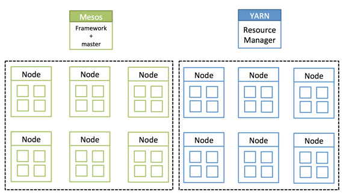

```{r setup, include=FALSE}
knitr::opts_chunk$set(echo = FALSE)
```

## What is Mesos?

Mesos is built using the same principles as the Linux kernel, only at a different level of abstraction. The Mesos
kernel runs on every machine and provides applications (e.g., Hadoop, Spark, Kafka, Elasticsearch) with API’s for
resource management and scheduling across entire datacenter and cloud environments.

It was designed at UC Berkeley in 2007 and hardened in production at companies like Twitter and Airbnb.

http://mesos.apache.org/

## Features

- Linear Scalability
- High Availability
- Containers
- Pluggable Isolation
- Two level scheduling
- APIs
- WebUI
- Cross Platform

## Architecture


## Example of resource offer

Let’s walk through the events in the figure.

* Agent 1 reports to the master that it has 4 CPUs and 4 GB of memory free. The master then invokes the allocation policy module, which tells it that framework 1 should be offered all available resources.
* The master sends a resource offer describing what is available on agent 1 to framework 1.
* The framework’s scheduler replies to the master with information about two tasks to run on the agent, using <2 CPUs, 1 GB RAM> for the first task, and <1 CPUs, 2 GB RAM> for the second task.
* Finally, the master sends the tasks to the agent, which allocates appropriate resources to the framework’s executor, which in turn launches the two tasks (depicted with dotted-line borders in the figure). Because 1 CPU and 1 GB of RAM are still unallocated, the allocation module may now offer them to framework 2.


## Example of resource offer


## In other words

Apache Mesos is a centralised fault-tolerant cluster manager. It’s designed for distributed computing environments to provide resource isolation and management across a cluster of slave nodes.

In some ways, Mesos provides the opposite to virtualisation:

* Virtualisation splits a single physical resource into multiple virtual resources
* Mesos joins multiple physical resources into a single virtual resource

It schedules CPU and memory resources across the cluster in much the same way the Linux Kernel schedules local resources.


## Overview

A Mesos cluster is made up of four major components:

* ZooKeepers
* Mesos masters
* Mesos slaves
* Frameworks

## Zookeeper

Apache ZooKeeper is a centralised configuration manager, used by distributed applications such as Mesos to coordinate activity across a cluster.

Mesos uses ZooKeeper to elect a leading master and for slaves to join the cluster.

http://zookeeper.apache.org/

## Mesos Masters

A Mesos master is a Mesos instance in control of the cluster.

A cluster will typically have multiple Mesos masters to provide fault-tolerance, with one instance elected the leading master.

## Mesos Slaves

A Mesos slave is a Mesos instance which offers resources to the cluster.

They are the ‘worker’ instances - tasks are allocated to the slaves by the Mesos master.

## Frameworks

On its own, Mesos only provides the basic “kernel” layer of your cluster. It lets other applications request resources in the cluster to perform tasks, but does nothing itself.

Frameworks bridge the gap between the Mesos layer and your applications. They are higher level abstractions which simplify the process of launching tasks on the cluster.

## Chronos

Chronos is a cron-like fault-tolerant scheduler for a Mesos cluster.

You can use it to schedule jobs, receive failure and completion notifications, and trigger other dependent jobs.

https://github.com/mesos/chronos

## Marathon

Marathon is the equivalent of the Linux upstart or init daemons, designed for long-running applications.

You can use it to start, stop and scale applications across the cluster.

https://github.com/mesosphere/marathon

## Others


* Aurora - service scheduler http://aurora.apache.org/
* Hadoop - data processing http://hadoop.apache.org/
* Jenkins - Jenkins slave manager https://github.com/jenkinsci/mesos-plugin
* Spark - data processing http://spark.apache.org/
* Torque - resource manager http://www.adaptivecomputing.com/products/open-source/torque/

## Mesos Schedulers

Mesos determines which resources are available, and it makes offers back to an application scheduler (the application scheduler and its executor is called a “framework”). Those offers can be accepted or rejected by the framework. This model is considered a non-monolithic model because it is a “two-level” scheduler, where scheduling algorithms are pluggable. Mesos allows an infinite number of schedule algorithms to be developed, each with its own strategy for which offers to accept or decline, and can accommodate thousands of these schedulers running multi-tenant on the same cluster.

## How does it compares to Hadoop?

Hadoop manages its own resources with Apache YARN (Yet Another Resource Negotiator)



