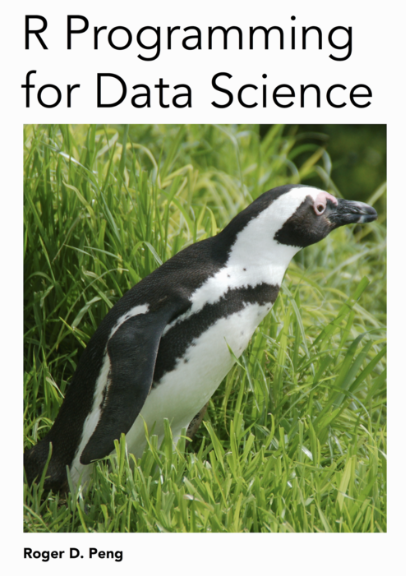

```{r setup, include=FALSE}
knitr::opts_chunk$set(echo = FALSE)
```

## R Programming

This is the R programming course, we'll try to focus in common tasks performed by a data scientist.

## Bibliography



(2014 - 2016) R Programming for Data Science
Roger D. Peng
Leanpub
You can get a copy [here](leanpub.com/rprogramming)

## What is R?

R is a dialect of S.

S is a language that was developed by John Chambers and others at the old Bell Telephone Laboratories, originally part of AT&T Corp. S was initiated in 1976 as an internal statistical analysis environment, originally implemented as Fortran libraries. Early versiones of the language did not even contain functions for statistical modeling.

In 1988 the system was rewritten in C and began to resemble the system that we have today (this was Version 3 of the language). The book *Statistical Models in S* by Chambers and Hastie (the white book) documents the statistical analysis functionality.Version 4 of the S language was released in 1988 and is the version that we use today. The book *Programming with Data* by John Chambers (the green book) documents this version of the language.

## Back to R

The R language came to use quite a bit after S had been deeloped. One key limitation of the S language was that it was only available in a commercial package, S-PLUS. In 1991, R was created by Ross Ihaka and Robert Gentleman in the Department of Statistics at the University of Auckland. In 1993 the first announcment of R was made to the public. Ross's and Robert's experience developing R is documented in a 1996 paper in the *Journal of Computational and Graphical Statistics*

> Ross Ihaka and Robert Gentleman. R: A language for data analysis and grapics. Jorual of Computational and Graphical Statistics, 5(3):299-314,1996

In 1995, Martin Mächler made an important contribution by convincing Ross and Robert to use the GNU General Public License to make R free software. This was critical because it allowed for the source code for the entire R system to be accessible to anyone who wanted to tinker with it (more on free software later).

In 1996, a public mailing list was created (the R-help and R-devel lists) and in 1997 the R Core Group was formed, containing some people associated with S and S-PLUS. Currently, the core group controls the source code for R and is solely able to check in changes to the main R source tree. Finally, in 2000 R version 1.0.0 was released to the public.

Fragment from: Roger D. Peng. “R Programming for Data Science”.

## Design of the R System

The primary R system is available from the [Comprehensive R Archive Network](cran.r-project.org), also known as CRAN. CRAN also hosts many add-on packages that can be used to extend the functionality of R.

The R system is divided into 2 conceptual parts:

- The "base" R system that you download from CRAN
- Everything else

R functionality is divided into a number of *packages*.

- The "base" R system contains, among other things, the `base` package which is required to run R and contains the most fundamental functions.
- The other packages contained in the "base" system indluce `utils`,`stats`, `datasets`, `graphics`, `grDevices`, `grid`, `methods`, `tools`, `parallel`, `compiler`, `splines`, `tcltk`, `stats4`.
- There are also "Recommended" packages: `boot`, `class`, `cluster`, `codetools`, `foreign`, `KernSmooth`, `lattice`, `mgcv`, `nlme`, `rpart`, `survival`, `MASS`, `spatial`, `nnet`, `Matrix`.

When you download a fresh installation from CRAN, you get all of the above.

## Other packages

- There are over 4000 packages on CRAN that have been evelope by users and programmers around the world.
- There are also many packages associated with the [Bioconductor Project](bioconductor.org).
- People often make packages available on their personal websites; there is no reliable way to keep track of how many packages are available in this fashion.
- There are a number of packages being developed on repositories like GitHub and BitBucket but there is no reliable listing of all these packages.

## Limitations of R

- Objects must generally be stored in physical memory
- Functionality is based on consumer demand


## R Resources

### Official manuals

As far as getting started with R by reading stuff, there is a course book also available on [CRAN](cran.r-project.org).

- [An Introduction to R](cran.r-project.org/doc/manuals/r-release/R-intro.html)

